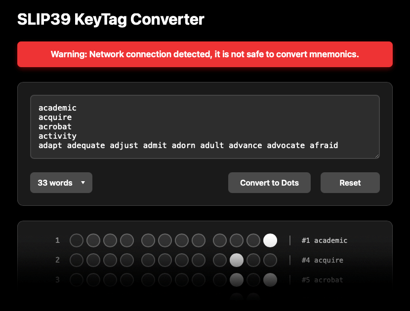

# SLIP39 KeyTag Converter

An educational tool that demonstrates how SLIP39 mnemonics convert to dot patterns, for use with [OneKey KeyTag](https://onekey.so/products/onekey-keytag/) hardware backup devices. This application shows the conversion process and KeyTag layout, for **learning purposes** only.



> [!WARNING]
> Under any circumstances, **do not enter actual cryptocurrency seed phrases into converter**, regardless of how secure your computer is. Mnemonics entered into any electronic device create security risks, including:
>
> - Memory persistence in RAM and browser caches
> - Potential exposure through swap files or system dumps  
> - Vulnerability to malware, screen recording, or keyloggers
> - Human error in data clearing procedures

## Features

The converter offers hands-on learning while maintaining strict security practices to protect users from accidentally exposing sensitive information. The following features are implemented:

- Interactive SLIP39 word-to-dot conversion
- Visual KeyTag layout simulation
- Real-time pattern validation
- Network connection warnings for security
- Educational examples and references

## Quick Start

### Prerequisites

This application requires `Node.js` and `npm`, install them with Homebrew or other similar tools:

```bash
brew install node
node --version
npm --version
```

### Installation

1. **Clone the repository:**
   ```bash
   git clone https://github.com/axivo/slip39-dotmap.git .
   ```

2. **Navigate to converter directory:**
   ```bash
   cd slip39-dotmap/converter
   ```

3. **Install dependencies:**
   ```bash
   npm install
   ```

### Running the Application

1. **Start the server:**
   ```bash
   npm start
   ```

2. **Open browser:**
   Navigate to `http://localhost:3000`

## Disclaimer

This tool is provided as-is for educational and personal use. Users are responsible for proper security practices, accurate implementation, and safe storage of physical KeyTags. The authors assume no responsibility for lost funds due to misuse or implementation errors.
